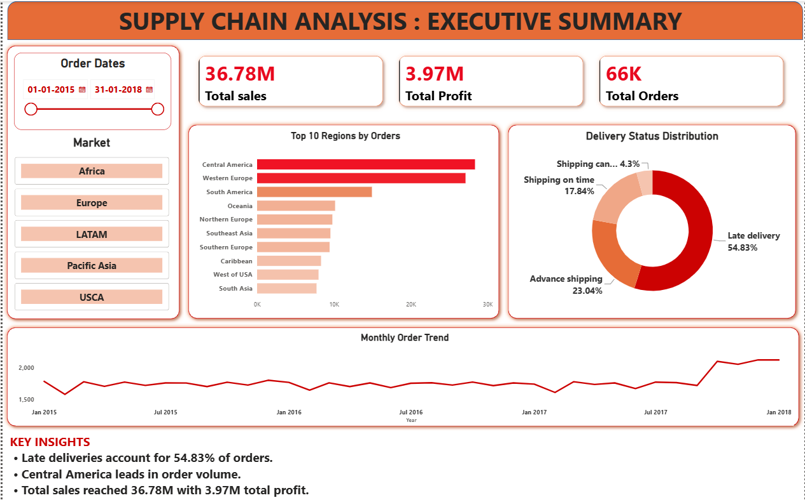
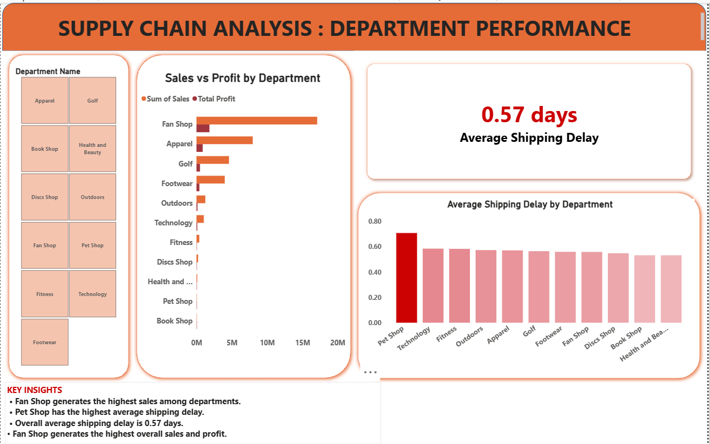

# Supply Chain Analysis

## 📌 Project Overview

This project analyzes supply chain data to identify trends in sales, profitability, customer segments, delivery performance, products, and regional performance.

The analysis was performed using SQL and Python, with the results visualized in Power BI.

## 🛠️ Tools Used

- MySQL
- Python
- Power BI
- Excel / CSV

## 🎯 Analysis Areas

- Overall sales and profit analysis
- Customer segment performance
- Product profitability
- Delivery performance
- Regional sales analysis
- Category and region performance
- High-sales, low-profit-margin analysis
- Supply-chain improvement opportunities

## 📊 Power BI Dashboard

### Dashboard Overview

### Department Performance

## 💡 Key Insights

- The Consumer customer segment generated the highest total sales and profit.
- Fishing in Central America generated the highest sales among Category + Region combinations.
- Late deliveries were associated with slightly lower average sales and profit per order.
- Some high-sales products and regions showed relatively lower profit margins, indicating potential areas for improvement.

## 📁 Project Files

- `supply_chain_analysis.sql` — SQL queries used for the analysis
- `01_data_check.py` — Python data-checking script
- `supply_chain_analysis_dashboard.pbix` — Power BI dashboard
- `dashboard_page1.png` — Dashboard screenshot
- `dashboard_page2.png` — Dashboard screenshot
